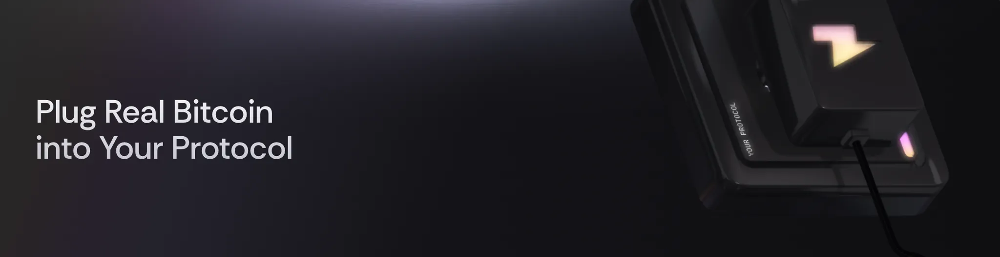

# BitcoinKit Widget

<div align="center">
  
  
  <p>Instantly add tokenized Bitcoin flows to any website or app—no code, no friction.</p>

[](https://www.npmjs.com/package/@zeus-network/bitcoin-kit-widget)
[](https://github.com/ZeusNetworkHQ/bitcoin-kit-widget/actions)
[](https://www.npmjs.com/package/@zeus-network/bitcoin-kit-widget)
[](https://opensource.org/licenses/MIT)

</div>

The BitcoinKit Widget is a JavaScript/React component library that provides a fully featured and customizable Bitcoin tokenization experience for web and mobile applications. The widget enables users to seamlessly deposit Bitcoin to receive zBTC (tokenized Bitcoin) and withdraw zBTC back to Bitcoin, all through an intuitive, embeddable interface.

The widget can be embedded directly into your organization's web or mobile applications for a seamless user experience, or used in a popup/modal format for minimal integration effort.

See the [Usage Guide](#usage-guide) for more information on how to get started using the Zeus Widget.

## Table of Contents

- [Quick Start](#quick-start)
- [Evaluation & Testing](#evaluation--testing)
- [Integration Modes](#integration-modes)
- [Wallet Setup](#wallet-setup)
  - [Derive Wallet](#derive-wallet)
- [Configuration](#configuration)
- [Development](#development)
- [Supported Bitcoin Wallets](#supported-bitcoin-wallets)

## Quick Start

```bash
# npm
npm install @zeus-network/bitcoin-kit-widget

# yarn
yarn add @zeus-network/bitcoin-kit-widget

# pnpm
pnpm add @zeus-network/bitcoin-kit-widget
```

```tsx
import {
  Widget,
  BitcoinNetwork,
  SolanaNetwork,
} from "@zeus-network/bitcoin-kit-widget";
import "@zeus-network/bitcoin-kit-widget/assets/style.css";

<Widget.Popover
  config={{
    bitcoinNetwork: BitcoinNetwork.Regtest,
    solanaNetwork: SolanaNetwork.Devnet,
  }}
>
  <Widget.Popover.Trigger asChild>
    <button>Open Widget</button>
  </Widget.Popover.Trigger>

  <Widget.Portal>
    <Widget.Popover.Content />
  </Widget.Portal>
</Widget.Popover>;
```

**Requirements**: React 18+ with Solana wallet providers ([setup guide](#wallet-setup))

## Evaluation & Testing

Try the widget without Bitcoin wallet extensions:

```tsx
import { useDeriveWalletConnector } from "@zeus-network/bitcoin-kit-widget/bitcoin-wallet-adapter";

const deriveWallet = useDeriveWalletConnector(BitcoinNetwork.Regtest);

<Widget.Popover
  config={{
    bitcoinNetwork: BitcoinNetwork.Regtest,
    solanaNetwork: SolanaNetwork.Devnet,
    bitcoinWallets: [deriveWallet], // Uses your Solana wallet
  }}
>
  {/* ... */}
</Widget.Popover>;
```

**Live Demo**: [playground.bitcoin-kit.dev](https://playground.bitcoin-kit.dev)

## Integration Modes

The widget supports three integration patterns to fit different use cases:

**Popover** (Recommended)

Displays the widget as a floating popover attached to a trigger element. Best for maintaining existing UI flow.

```tsx
<Widget.Popover config={config}>
  <Widget.Popover.Trigger asChild>
    <button>Open</button>
  </Widget.Popover.Trigger>

  <Widget.Portal>
    <Widget.Popover.Content />
  </Widget.Portal>
</Widget.Popover>
```

**Modal**

Shows the widget in a modal dialog overlay. Ideal for focused user interactions.

```tsx
<Widget.Dialog config={config}>
  <Widget.Dialog.Trigger asChild>
    <button>Open</button>
  </Widget.Dialog.Trigger>

  <Widget.Portal>
    <Widget.Dialog.Content />
  </Widget.Portal>
</Widget.Dialog>
```

**Embedded**

Renders the widget directly inline with your content. Perfect for dedicated pages or sections.

```tsx
<Widget config={config} />
```

## Wallet Setup

The widget requires Solana wallet providers to function. Set up the wallet context at your application root:

```tsx
import {
  ConnectionProvider,
  WalletProvider,
} from "@solana/wallet-adapter-react";
import { PhantomWalletAdapter } from "@solana/wallet-adapter-wallets";
import { clusterApiUrl } from "@solana/web3.js";
import "@solana/wallet-adapter-react-ui/styles.css";

const wallets = [new PhantomWalletAdapter()];
const endpoint = clusterApiUrl("devnet");

function App() {
  return (
    <ConnectionProvider endpoint={endpoint}>
      <WalletProvider wallets={wallets} autoConnect>
        {/* Your app with Widget */}
      </WalletProvider>
    </ConnectionProvider>
  );
}
```

### Bitcoin Wallet Connectors

The widget supports multiple Bitcoin wallets through connector classes. You can customize which wallets are available to users by providing a `bitcoinWallets` array in the config.

#### Custom Wallet Selection

Specify which wallets to support for your use case:

```tsx
import {
  UniSatConnector,
  XverseConnector,
  PhantomConnector,
  useDeriveWalletConnector,
} from "@zeus-network/bitcoin-kit-widget/bitcoin-wallet-adapter";

function MyComponent() {
  const deriveWallet = useDeriveWalletConnector(BitcoinNetwork.Testnet);

  const bitcoinWallets = [
    new UniSatConnector(),
    new XverseConnector(),
    new PhantomConnector(),
    ...(deriveWallet ? [deriveWallet] : []), // Add derive wallet if available
  ];

  return (
    <Widget.Popover
      config={{
        bitcoinNetwork: BitcoinNetwork.Testnet,
        solanaNetwork: SolanaNetwork.Devnet,
        bitcoinWallets, // Custom wallet list
      }}
    >
      {/* ... */}
    </Widget.Popover>
  );
}
```

#### Available Connectors

```tsx
import {
  // Production wallets
  PhantomConnector, // Mainnet only
  UniSatConnector, // Mainnet/Testnet
  OKXConnector, // Mainnet/Testnet
  XverseConnector, // Mainnet/Testnet/Regtest

  // Development wallets
  MusesConnector, // Regtest only
  useDeriveWalletConnector, // Hook for derive wallet
} from "@zeus-network/bitcoin-kit-widget/bitcoin-wallet-adapter";
```

#### Network-Specific Wallet Setup

Different wallets support different networks. Here are recommended configurations:

**Mainnet Configuration:**

```tsx
const bitcoinWallets = [
  new PhantomConnector(),
  new UniSatConnector(),
  new OKXConnector(),
  new XverseConnector(),
];

const config = {
  bitcoinNetwork: BitcoinNetwork.Mainnet,
  solanaNetwork: SolanaNetwork.Mainnet,
  bitcoinWallets,
};
```

**Development Configuration:**

```tsx
function DevelopmentSetup() {
  const deriveWallet = useDeriveWalletConnector(BitcoinNetwork.Regtest);

  const bitcoinWallets = [
    new XverseConnector(), // Supports Regtest
    new MusesConnector(), // Development-focused
    ...(deriveWallet ? [deriveWallet] : []),
  ];

  return (
    <Widget.Popover
      config={{
        bitcoinNetwork: BitcoinNetwork.Regtest,
        solanaNetwork: SolanaNetwork.Devnet,
        bitcoinWallets,
      }}
    >
      {/* ... */}
    </Widget.Popover>
  );
}
```

#### Wallet Detection

The widget automatically detects which wallets are installed and ready:

```tsx
import { UniSatConnector } from "@zeus-network/bitcoin-kit-widget/bitcoin-wallet-adapter";

const unisatWallet = new UniSatConnector();

// Check if wallet is available
if (unisatWallet.isReady()) {
  console.log("UniSat wallet is installed and ready");
} else {
  console.log("UniSat wallet not found - user will see install prompt");
}
```

### Derive Wallet

The Derive Wallet is a unique feature that creates a Bitcoin wallet derived from your connected Solana wallet. This eliminates the need to install Bitcoin wallet extensions during development and testing.

#### How It Works

1. **Derives Bitcoin Private Key**: Uses your Solana wallet's signature to deterministically generate a Bitcoin private key
2. **Creates Bitcoin Addresses**: Generates P2PKH, P2WPKH, and P2TR (Taproot) addresses from the derived key
3. **Signs Transactions**: Can sign PSBTs (Partially Signed Bitcoin Transactions) for Zeus Widget operations
4. **Development Focus**: Only works on Testnet and Regtest networks for security

#### Key Benefits

- ✅ **No Installation Required**: Uses your existing Solana wallet
- ✅ **Deterministic**: Same Solana wallet always generates the same Bitcoin wallet
- ✅ **Full Integration**: Works seamlessly with all Zeus Widget features
- ✅ **Development Friendly**: Perfect for testing and prototyping
- ✅ **Secure**: Private keys are derived locally and never transmitted

#### Usage

```tsx
import { useDeriveWalletConnector } from "@zeus-network/bitcoin-kit-widget/bitcoin-wallet-adapter";

function MyComponent() {
  const deriveWallet = useDeriveWalletConnector(BitcoinNetwork.Regtest);

  // deriveWallet will be null if Solana wallet is not connected
  if (!deriveWallet) {
    return <div>Please connect your Solana wallet first</div>;
  }

  return (
    <Widget.Popover
      config={{
        bitcoinNetwork: BitcoinNetwork.Regtest,
        solanaNetwork: SolanaNetwork.Devnet,
        bitcoinWallets: [deriveWallet],
      }}
    >
      <Widget.Popover.Trigger asChild>
        <button>Open Widget with Derive Wallet</button>
      </Widget.Popover.Trigger>

      <Widget.Portal>
        <Widget.Popover.Content />
      </Widget.Portal>
    </Widget.Popover>
  );
}
```

#### Technical Details

- **Supported Networks**: Regtest only (not Mainnet for security)
- **Address Types**: Primarily uses P2TR (Taproot) addresses
- **Signing**: Supports PSBT signing with tweaked keys
- **Apollo Integration**: Compatible with [playground.bitcoin-kit.dev](https://playground.bitcoin-kit.dev) and [https://app.apolloportal.io/claim](https://https://app.apolloportal.io/claim) for claiming test funds

#### Limitations

- **Development Only**: Not available on Bitcoin Mainnet, only for development purpose
- **Solana Dependency**: Requires active Solana wallet connection
- **Network Restrictions**: Cannot switch Bitcoin networks dynamically

## Configuration

### Basic Options

Core configuration options for all widget instances:

```tsx
{
  bitcoinNetwork: BitcoinNetwork.Mainnet | BitcoinNetwork.Testnet | BitcoinNetwork.Regtest,
  solanaNetwork: SolanaNetwork.Mainnet | SolanaNetwork.Devnet | SolanaNetwork.Testnet,
  bitcoinWallets?: WalletConnector[], // Optional: custom wallet adapters list
  onSuccess?: (message: string) => void,
  onError?: (error: Error) => void,
}
```

For detailed configuration options, see [`docs/configuration.md`](./docs/configuration.md).

### Style Isolation

For projects not using Tailwind CSS, wrap the widget with `ZeusShadow` to prevent style conflicts:

```tsx
import { ZeusShadow } from "@zeus-network/bitcoin-kit-widget";

<ZeusShadow>
  <Widget config={config} />
</ZeusShadow>;

// or

<Widget.Popover config={config}>
  <Widget.Popover.Trigger>
    <button className="my-app-button" />
  </Widget.Popover.Trigger>

  <Widget.Portal>
    <ZeusShadow>
      <Widget.Popover.Content />
    </ZeusShadow>
  </Widget.Portal>
</Widget.Popover>;
```

## Development

### Local Setup

Clone and set up the development environment:

```bash
git clone https://github.com/ZeusNetworkHQ/bitcoin-kit-widget.git
cd bitcoin-kit-widget
pnpm install
```

### Available Commands

```bash
pnpm dev            # Start development servers
pnpm build          # Build all packages
pnpm lint           # Run linting
pnpm test           # Run tests
pnpm playground dev # Start demo app
```

### Project Structure

```
root/
├── apps/playground/                 # Demo Next.js app
└── packages/
    ├── bitcoin-kit-widget/          # Main widget library
    ├── bitcoin-wallet-adapter/      # Bitcoin wallet connectors
    └── client/                      # API client utilities / Program interaction procedures
```

## Supported Bitcoin Wallets

### Production Wallets (Mainnet/Testnet)

- **Phantom**: Multi-chain wallet (Mainnet only)
- **UniSat**: Desktop/mobile Bitcoin wallet
- **OKX**: Multi-chain wallet
- **Xverse**: Bitcoin and Stacks wallet

### Development Wallets (Regtest)

- **Derive Wallet**: Derived from Solana wallet (no installation needed)
- **Muses**: Bitcoin-focused development wallet

## Contributing

We're happy to accept contributions and PRs! Please see the [contribution guide](./CONTRIBUTING.md) to understand how to structure a contribution.

### Development Workflow

1. Fork the repository
2. Create a feature branch: `git checkout -b feature/amazing-feature`
3. Make your changes and add tests
4. Commit your changes: `git commit -m 'feat: add amazing feature'`
5. Push to the branch: `git push origin feature/amazing-feature`
6. Open a Pull Request

## License

This project is licensed under the MIT License - see the [LICENSE](./LICENSE) file for details.

## Support

- 🌐 [BitcoinKit](https://zeusnetwork.xyz/bitcoin-kit) - Official website
- 📖 [Documentation](https://zeusnetwork.xyz/developers) - Developer docs
- 💬 [Discord](https://discord.gg/zeusnetwork) - Community support
- 🔗 [X](https://x.com/BitcoinKitDev) - Updates and news

## Built With

- [React](https://reactjs.org/) - UI library
- [TypeScript](https://www.typescriptlang.org/) - Type safety
- [Vite](https://vitejs.dev/) - Build tool
- [Pnpm](https://pnpm.io/) - Package manager
- [Turborepo](https://turbo.build/) - Monorepo build system
- [Tailwind CSS](https://tailwindcss.com/) - Styling
- [Solana Web3.js](https://solana-labs.github.io/solana-web3.js/) - Solana integration
- [Radix UI](https://www.radix-ui.com/) - UI primitives

---

**Links**: [Demo](https://playground.bitcoin-kit.dev) • [BitcoinKit](https://zeusnetwork.xyz/bitcoin-kit) • [Docs](https://zeusnetwork.xyz/developers) • [Discord](https://discord.gg/zeusnetwork)
